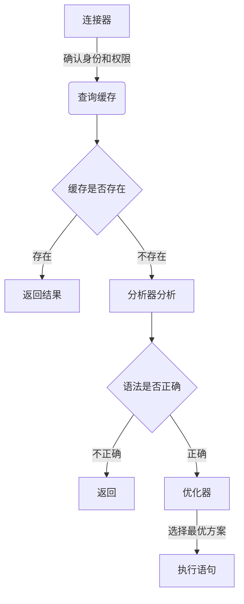

Mysql会通过一系列组件，将SQL语句层层推进，最后获得结果返回。大致如下：

**MySQL主要分为了Server层和存储引擎层**
**Server层**：就包括了上面几个连接器、查询缓存、分析器、优化器和执行器等，还包括存储过程、触发器、视图和函数等，还有一个通用的日志模块。
**存储引擎**：负责数据的存储和读取，采用可以替换的插件式架构，支持InnoDB、MyISAM、Memory等多个存储引擎。最常用InnoDB，5.5.5版本后当作默认存储引擎了。

下面在详细介绍下 Server层的几个组件：

| 组件名称 | 说明 |
| --- | --- |
| 连接器 |身份认证和权限相关。登陆后连接器会到权限表中查询该用户权限，之后连接里的权限逻辑判断都依赖此时读到的结果，只要连接不断开，管理员即使修改权限也不受影响。  |
| 查询缓存 |8.0版本后移除，不太实用。对于不太常更新的数据来说，使用缓存还是可以的。  |
| 分析器 | 先词法分析，再语法分析 |
| 优化器 | 使用其认为最优的方案去执行，但有时候不一定是最优的 |
|执行器  |开始执行前还是会再校验用户权限，有权限调用引擎接口，返回接口执行的结果。  |